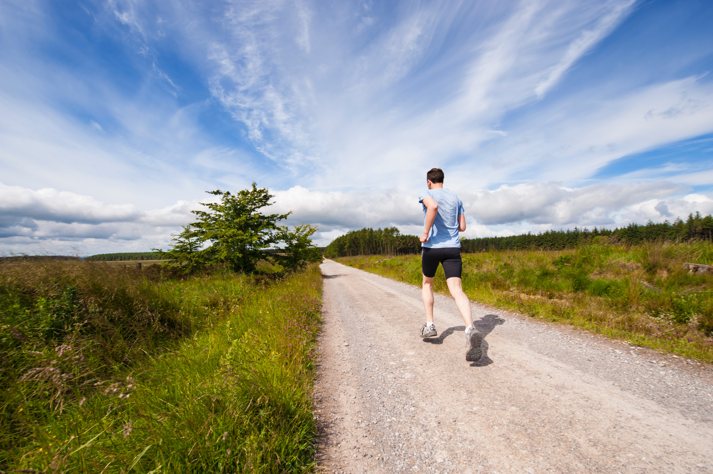

Two weeks ago I finished __*Born To Run: A Hidden Tribe, Superatheletes, and the Greatest Race the World Has Never Seen*__, and I'd like to share my thoughts on the book.

I'm throwing __*Born To Run*__ onto my "Must Read" pile - especially for anyone who runs/jogs/walks in their spare time. This book is an enjoyable mashup of anthropological study and story-telling. The main plot follows the author, Christopher McDougall, on his journey into the Copper Canyons to try and find the answer to the opening question: "My does my knee hurt when I run?". What begins as a nagging knee pain for the author ends as an exploatory  between Man's relationship and history with running. 

###### Photo by [Jenny Hill](https://unsplash.com/photos/mQVWb7kUoOE?utm_source=unsplash&utm_medium=referral&utm_content=creditCopyText)

The adventure McDougall embarks is fascinating and educational, but also a bit slow. The story spends a lot of time jumping around, and it can take a while for the payoff. The real meat of the story lies within the Tarahumara tribe, the hidden tribe hinted at in the subtitle. McDougall uses this "lost" tribe as a contextual background for the history of running. From Neanderthals to Nike entering the running scene in the 70's, by the end of this book you will feel well educated on the subject of long-distance running in America. 

I started running in college as part of my boxing workout regime. Back then I just called it "roadwork", and it was just one workout of many to get into fighting shape. I ended up only boxing for 6 months, but I have run ever since. As much as I've enjoyed running, I can't say I'm that knowlegable on the subject. I think the most I've ever done is cruise around on Runnersworld.com back in college.

> There is no higher achievement a book can reach, I think, than making a change in your lifestyle.

I wish I would have discovered *Born To Run* back when I first started to run. This book feels like the perfect "Intro to Running" primer - I feel confident that anyone who has read it will come away with a greater appreciation for the act of running as a whole.

This book kicked my lazy butt into gear and really reinvigorated running for me. I've even been enjoying my runs *without* bringing music along. Running without music puts the focus back on the run, and I've racked up 6 miles in a week. Not bad considering the last time I went on a run was in December.

There is no higher achievement a book can reach, I think, than making a change in your lifestyle. If you are a runner in a slump, *Born To Run* is the kick in the butt you didn't know you needed.

<small>**Foot Note*:The length of the subtitle bothers me. It feels like the result of a publisher suggesting one too many marketing angles. It sort of takes away some of the romance, ya know? </small>