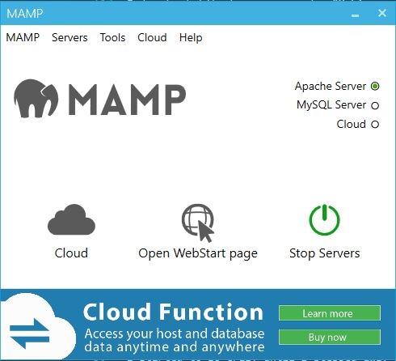

Most web developers have pretty strong opinions on [Wordpress](https://wordpress.org/). I've never done major techinical work in Wordpress - I've customized a few themes and have pushed a few posts in my day, but I haven't created a plugin or created a theme from scratch.

At least I hadn't until a few weeks ago. I decided to dive in and build my very own Wordpress theme. 

> New errors can be as exciting as they are terrifying - am I moving closer toward or away from my goal?

I downloaded Wordpress, opened a "Making your first wordpress theme" tutorial, and hit the ground running. Having only used PHP and mySQL for my twitter-clone project, I was amazed at how easy it was to get everything up and running. __I didn't have a single issue. . . Until last night.__

My adorable dumb cat, Loki, jumped directly onto tower's restart button. When I finished rebooting, Wordpress was suddenly throwing a fit. Whenever I tried to access my localhost/wordpress-domain, I would get the error "No connection could be made because the target machine actively refused it.". 

After some poking around, I found out that it wasn't *actually* Wordpress's fault - My MAMP mySQL servers had stopped turning on.

The light next to MySQL Server should be lit up. It's not.

__Wordpress kept saying "No connection could be made because the target machine actively refused it.", but I had no idea what this error meant.__

I relied on every programmer's dig-out-of-this-hole secret technique: Googling the error and combing through stackedoverflow posts. I tried just about everything that seemed even half reasonable. Finally, one of solutions marched me further to my goal - Deleting the mysql-bin.index files. 

I was now seeing a new error. New errors can be as exciting as they are terrifying - am I moving closer toward or away from my goal?

Wordpress was now asking me to install, which was troubling because of course it was already installed.. I wasn't exactly sure what installing would do to my files, so I continued my search on google.

Four hours down and I hadn't even started programming for the day yet, so I made a drastic decision. I would move away from MAMP entirely. I still had XAMPP from a previous project, so I migrated everything from my MAMP /htdocs file to my XAMP /htdocs.

And wouldn't you know it - another new error. This time the root user had invalid permissions. I remembered I had changed the password for XAMPP's database from root to ******, but updating that still gave me permission

I learned that XAMPP has a tool called "resetbat" that resets the username and password to root (Or something.) No dice solving my issue though.

I checked, double checked, and triple checked any kind of config file I could find. wp-config seemed fine. 

I started to go crazy until I stepped away and thought about it more.

Ok, I know i'm getting a permission error. Why? Why am I getting this? I slowly and carefully checked the privledges in my phpMyAdmin. Everything looked good.

I went back to my wp-config file. Everything still looked good - but I had a second thought. What if I haven't been looking at the *right* wp-config file.

Lo' and behold, that was my issue. I had been updating the password on the *wrong* config file. 

So in recap, here is my problem tree:

1. MAMP is not loading it's mySQL server.
2. ATTEMPT: Delete log files in MAMP/DB/MYSQL. No effect
3. SOLUTION: Delete mysql-bin.index files, restart servers. This worked, but brought my to my next issue.
4. "No connection could be made because the target machine actively refused it."
5. ATTEMPT: Disable all firewalls
6. ATTEMPT: Restore priveledges to root user
7. SOLUTION: Delete MAMP and move to XAMPP. I ended up reading lots of MAMP users who had the same mySQL server issues, and I've never experienced any with XAMPP.
8. "Access Denied for User 'root'@'localhost' (using password: YES) - No Privileges?
9.    3A: ATTEMPT: Tried to restore priveledges again
10.    3B: ATTEMPT: Recreate the database in XAMPP
 11.   3C: Solution: Update the *correct* wp-config, ya siily! 
