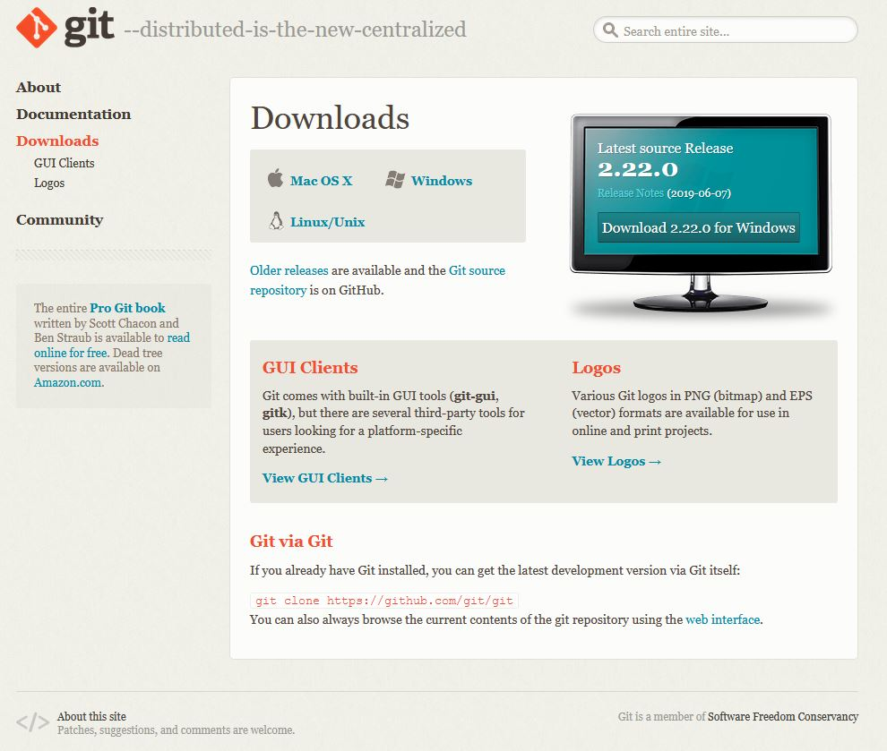
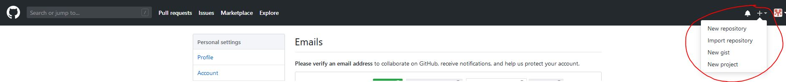
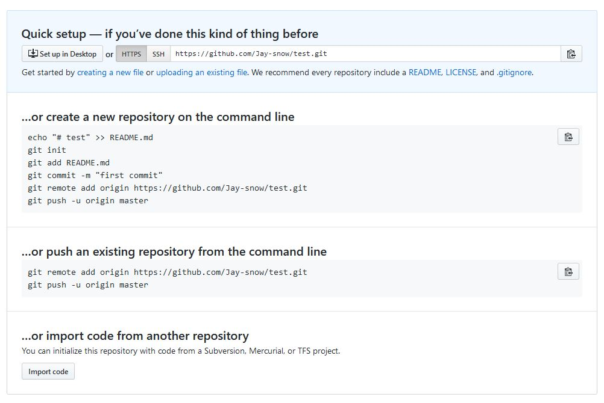

Table of Contents

1. [What is Git?](#gitlink)
2. [Getting Git on Windows](#installation)
3. [Setting up our Github](#github)

<h1> <a id="gitlink"style="color:inherit;">#What is Git?</a> </h1>

If you're reading this guide, chances are you already know what Git is. For the uninitiated, __Git is a version-control system, used to track changes in files__. Git is entirely separate from *Github.com*, which is just a web platform that developers use Git on.

References:
+ https://git-scm.com/

<h1> <a id="installation" style="color:inherit;"># Getting Git on Windows</a> </h1>

Git was developed for Linux  - which means we don't have native access to it on a Windows machine. We will need to install Git Bash, which will provide us a terminal that we can use with Git. Use the link below to 

Install Git Bash: [Git Bash](https://git-scm.com/downloads).

<em>This is what the download page looked like in 2019.</em>

Download the version for windows and follow the installer to win. If you're unsure of any setting when installing Git, go with the recommend and/or leave the default options.
***
<h1> <a id="github" style="color:inherit;"># Setup your Github.com </a> </h1>

Github is the most popular option for hosting git repositories, so it's the one we'll work with for this tutorial. 

Go to github.com and signup to make an account. The sign up process is only a few steps, so it won't take long. Once you have signed up and made your account, you should be looking at your profile page. Let's add our first repository. 

Use the + in the top right to create a new repo:

Name your repository whatever you want! And you're done!

You'll see this final screen, which will give you the final instructions needed to get your files into Github. Simply follow the first set of instructions labeled "...or create a new repository on the command line."

