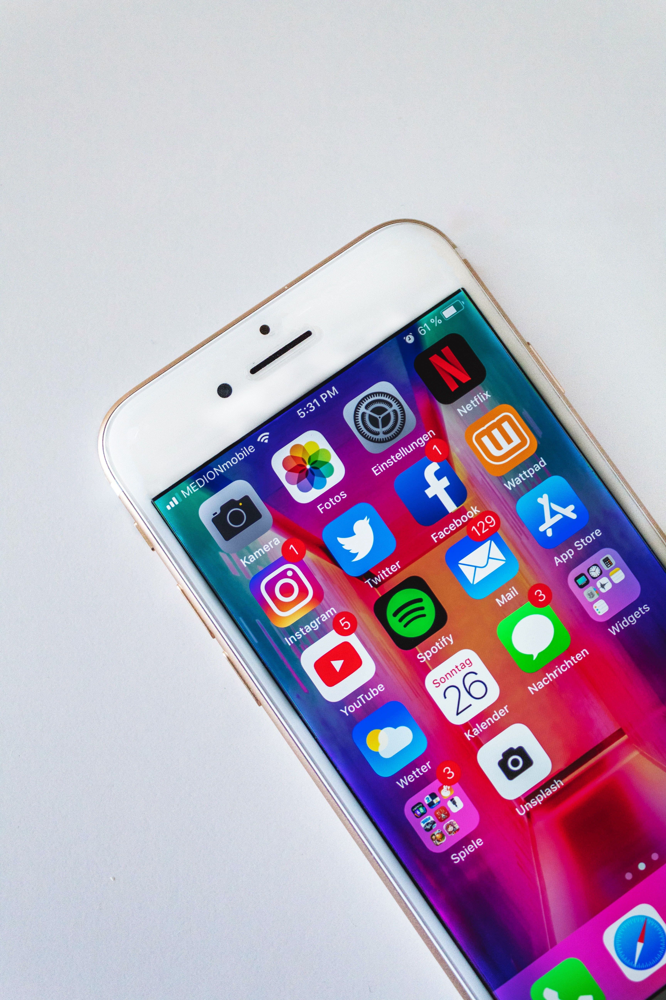

Photo by [Sara Kurfeß](https://unsplash.com/@stereophototyp)t

On April 9th I decided to go on a social media hiatus. For me this meant no more Twitter, no more Reddit, and eventually no more Youtube. (I waffled on whether Youtube qualifies as a social media website, but ultimately decided it checked enough boxes)

If you're an iPhone user, than you've probably gotten a weekly phone usage summary sent to you before. I have no idea if android phones do this, but thanks to this little notification I realized  I was spending 8 hours a week on social media -- and that's just on my phone. It doesn't *feel* like I'm spending an hour a day on my phone, but the proof is in the pudding.

This inspired me track my time for a week. This is something I've done on and off throughout my life, and it is always a revealing process to undertake. Combined with my computer time, I spend around 20 hours a week on social media. That's a part time job. So I quit the habit cold turkey. 

In a week's time, I've already noticed a lot of changes.

# The Pros
* __Increased productivity.__ In the week without social media I created this website, and flew my first ever drone. I am writing this blog entry at 5:47 AM on a Monday morning, time previously allocated to catching up on youtube videoes. 
* __More time spent with hobbies__. I use social media to procrastinate a lot, even if it means procrastinating on relaxing. 
* __Less anxiety__. This should have been expected, given it's one of the most popular headlines you see on the internet. Quitting social media for me has meant a few more periods in the day where I sit silently with my thoughts. 

# The Cons
*__Feeling disconnected__. I am experiencing some real FOMO right now. What's going on in the twitterverse? I bet there's a ton of new youtube videoes I haven't seen. Wouldn't having a bigger follower account be good for my career?

*__Harder to find random awesome__. Sometimes someone on your feed will expose you to something awesome that you would have never stumbled upon in your normal circles. Without social media I am much more deliberate in my time, and this comes at the cost of missing out from time to time.

# Conclusion

The plan was to give up social media for a week and see how it went. So far, it's going so well I want to extend this out another week. I think the obvious thing to do now is to track my time again. As obnoxious as time tracking can be, it really can be an eye opening activity.