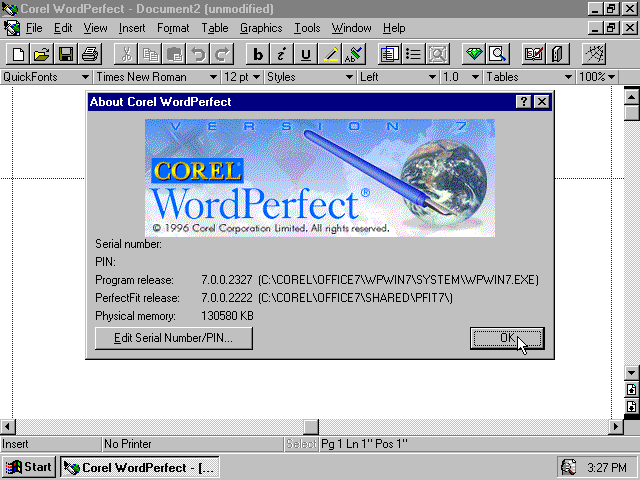
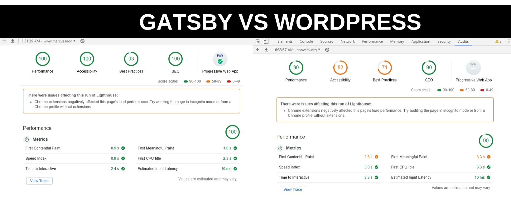

>Keep only those things that speak to your heart. Then take the plunge and discard all the rest. 
>By doing this, you can reset your life and embark on a new lifestyle.

There are about a milion ways to create a blog in under 10 minutes nowadays.

Want something simple and easy? You can get a [blogger account](https://blogger.com) and get started writing immediately.

Want something with native social sharing and easy visibility? Try out [tumblr.com](https://tumblr.com) or [medium.com](https://medium.com), two platforms that are all about getting eyes on your writing.

So why did I take half a day to setup a Gatsby blog?

## 1. I wanted something with minimal barriers to write.

I opened this post with a quote from Marie Kondo. 

I have been writing on a computer since I was 10 years old. I am 29 now. In those 19 years writing has changed *a lot*.

*Anyone remember WordPerfect? It's the first writing program I ever used.*

So far, for my entire career I've written in online text editors. CKEditor, Google Docs, and Wordpress are a few I've become well accustomed too. But there was always something a bit funky about using online web editors. All in all they are powerful, but there's a ton of little things that ultimately produce a ton of friction. Their websites can be a little slow, you will probably need to login to something (and maybe complete a captcha), and they might do some funky formatting behind the scenes.

There is no barrier to writing a post with Gatsby. I don't need to login to anything, I don't need to navigate through a website to my entry - all I need to do is fire up Visual Studio Code and get to writing.

##2. Gatsby websites are very fast

I have a Wordpress blog that I write on occasionally. Here are the light house scores between the two websites:

*You may need to click this image to see it better.*

Gatsby beats my Wordpress outright, and my Wordpress is pretty plugin-light. Being a gamer, input lag is something I'm highly sensitive to. Gatsby *feels* great, there is virtually no delay from when I click a link and the page loads. 

## 3. I have never used React, Node.Js, Markdown, or Netlify before.

One of the reasons I decided *not* to use Wordpress was that making another wordpress blog wouldn't teach me nearly as much as making a Gatsby blog. I already know HTML, CSS, Javascript, and PHP. This seemed like a perfect time to finally catch up with the rest of the world by exploring these technologies.

I have already spent some time on Stacked Overflow debugging errors - and I wouldn't want it any other way. For me at least, the most fun tech projects are the ones where you know the least.

# Conclusion

There's still a lot of work I need to do on this website, but I've really enjoyed setting up the foundation. I want to make a few other sections of this website that can highlights projects I've made, as well as post my resume on here.

